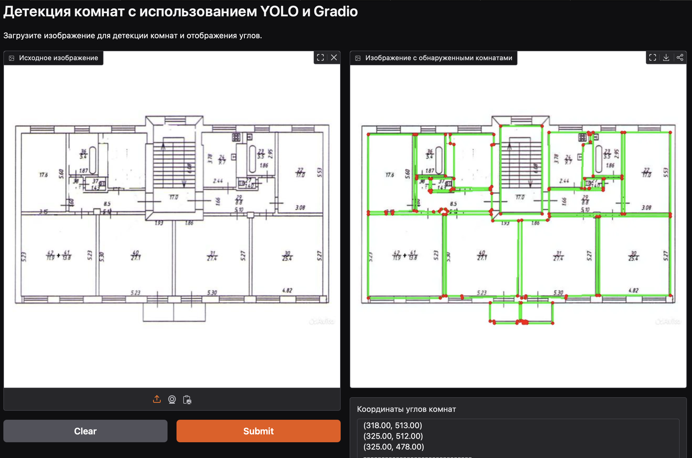

# Plan Points — Преобразование планов помещений в координаты опорных точек

Этот проект посвящён разработке системы компьютерного зрения, которая преобразует планы помещений в набор координат опорных точек (углов). С использованием предобученной модели YOLO для сегментации и оптимизации полигонов, приложение позволяет:

- Детектировать помещения (комнаты) на плане.
- Оптимизировать найденные полигоны, оставляя только действительные углы.
- Выводить координаты углов для последующей 3D визуализации.

---

## Оглавление

1. [Описание проекта](#описание-проекта)
2. [Особенности реализации](#особенности-реализации)
3. [Требования](#требования)
4. [Установка](#установка)
   - [Локальный запуск через Docker](#локальный-запуск-чрез-docker)
   - [Развертывание на Hugging Face Spaces](#развертывание-на-hugging-face-spaces)
5. [Использование](#использование)
6. [Результаты](#результаты)
7. [Рекомендации по улучшению](#рекомендации-по-улучшению)
8. [Контакты](#контакты)

---

## Заказчик

[XR Place](https://xrplace.io) — компания, создающая интерактивные 3D квартиры и дома для сайтов застройщиков. Проект направлен на получение точных координат опорных точек по плану помещения для последующей 3D визуализации.

---

## Описание проекта

В рамках проекта **Plan Points** разработана система, которая:
- Принимает на вход изображение плана помещения.
- С помощью модели YOLO сегментирует помещение, выявляя объекты класса «room».
- Оптимизирует контуры обнаруженных объектов, оставляя только значимые углы или аппроксимируя дуговые участки.
- Возвращает аннотированное изображение и список координат углов каждого обнаруженного помещения.

---

## Особенности реализации

- **Модель YOLO для сегментации:** Использование предобученной модели YOLO (весовой файл `model.pt`) для детекции комнат на плане.
- **Оптимизация полигонов:** Применение алгоритма упрощения с сохранением действительных углов и аппроксимацией дуг для корректного отображения кривых участков.
- **Интерактивный Gradio-интерфейс:** Веб-приложение, позволяющее загружать изображение и просматривать результаты детекции в режиме реального времени.
- **Docker- и Hugging Face Spaces:** Возможность разворачивать проект как локально с помощью Docker, так и в облаке на Hugging Face Spaces.

---

## Требования

- **Python**
- **PyTorch**, **torchvision**
- **Ultralytics** (YOLO)
- **NumPy**
- **OpenCV (opencv-python-headless)**
- **Gradio**

Список зависимостей приведён в файле [requirements.txt](requirements.txt).

---

## Установка

### Локальный запуск через Docker

1. **Клонируйте репозиторий:**
   ```bash
   git clone https://github.com/DanielNRU/plan_points.git
   cd plan_points
   ```

2. **Соберите Docker-образ:**
   ```bash
   docker build -t danielnru/plan_points .
   ```

3. **Запустите контейнер:**
   - **С поддержкой GPU (если доступно):**
     ```bash
     docker run --gpus all -p 7860:7860 danielnru/plan_points
     ```
   - **Без GPU:**
     ```bash
     docker run -p 7860:7860 danielnru/plan_points
     ```

4. **Откройте браузер** и перейдите по адресу:  
   [http://localhost:7860](http://localhost:7860)

---

### Развертывание на Hugging Face Spaces

1. **Клонируйте репозиторий Space:**
   ```bash
   git clone https://huggingface.co/spaces/DanielNRU/plan_points
   ```

2. **Создайте или обновите файл `app.py`**, а также разместите файлы [requirements.txt](requirements.txt) и `model.pt` (вес модели) в корневой директории Space.

3. **Закоммитьте и запушьте изменения:**
   ```bash
   git add app.py requirements.txt model.pt README.md
   git commit -m "Добавление файлов приложения"
   git push
   ```

4. **После сборки** ваш Space будет запущен и доступен по URL:  
   [https://huggingface.co/spaces/DanielNRU/plan_points](https://huggingface.co/spaces/DanielNRU/plan_points)



---

## Использование

1. **Запустите приложение** (локально через Docker или на Hugging Face Spaces).
2. **Загрузите изображение** плана помещения через Gradio-интерфейс.
3. **Получите результат:**  
   - Аннотированное изображение с выделенными комнатами.  
   - Список координат углов для каждого обнаруженного помещения.

---

## Результаты

В результате работы система обеспечивает:
- Определение границ помещений на планах.
- Оптимизированное представление полигонов с сохранением ключевых углов.
- Вывод координат, пригодных для дальнейшей 3D визуализации.

---

## Рекомендации по улучшению

- Увеличение объёма обучающих данных для повышения обобщающей способности модели.
- Исследование новых алгоритмов аппроксимации полигонов для ещё более точного определения углов.
- Оптимизация архитектуры модели и гиперпараметров для ускорения инференса.

---

## Контакты

**Разработчик:**  
Мельник Даниил Владимирович  
- **Email:** git@danieln.ru  
- **GitHub:** [DanielNRU](https://github.com/DanielNRU)  
- **Hugging Face:** [DanielNRU](https://huggingface.co/DanielNRU)

---